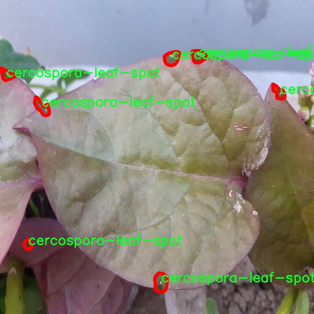

# 植物叶片病害分割系统源码＆数据集分享
 [yolov8-seg-fasternet-bifpn＆yolov8-seg-attention等50+全套改进创新点发刊_一键训练教程_Web前端展示]

### 1.研究背景与意义

项目参考[ILSVRC ImageNet Large Scale Visual Recognition Challenge](https://gitee.com/YOLOv8_YOLOv11_Segmentation_Studio/projects)

项目来源[AAAI Global Al lnnovation Contest](https://kdocs.cn/l/cszuIiCKVNis)

研究背景与意义

植物病害是影响农业生产和食品安全的重要因素，随着全球气候变化和农业生产方式的转变，植物病害的发生频率和种类不断增加。根据统计，植物病害每年导致全球农作物损失高达数千亿美元，严重影响了农民的收入和粮食供应链的稳定性。因此，及时、准确地识别和诊断植物病害，成为现代农业管理中亟待解决的问题。传统的病害识别方法依赖于人工观察和经验判断，存在效率低、准确性差等问题，难以满足大规模农业生产的需求。随着计算机视觉和深度学习技术的快速发展，基于图像处理的病害识别系统逐渐成为研究热点。

在众多深度学习模型中，YOLO（You Only Look Once）系列因其实时性和高效性被广泛应用于目标检测和分割任务。YOLOv8作为该系列的最新版本，具备更强的特征提取能力和更高的检测精度。然而，针对植物叶片病害的特定需求，YOLOv8仍存在一定的局限性，如对细小病害特征的识别能力不足、背景干扰对分割结果的影响等。因此，基于改进YOLOv8的植物叶片病害分割系统的研究显得尤为重要。

本研究所使用的数据集“affected-leaves-instSegmentation”包含4400张标注图像，涵盖了7种常见的植物病害类别，包括炭疽病、叶斑病、霜霉病、枯萎病、白粉病、白锈病和黄花叶病。这些病害的多样性为模型的训练提供了丰富的样本，有助于提高模型的泛化能力和识别准确率。通过对这些数据的深入分析，可以挖掘出不同病害的特征，进而优化YOLOv8的网络结构和训练策略，使其更适合于植物病害的实例分割任务。

此外，植物病害的早期识别不仅可以帮助农民及时采取防治措施，减少损失，还能为农业管理提供科学依据，推动精准农业的发展。通过构建高效的植物叶片病害分割系统，可以实现对病害的自动化监测，提升农业生产的智能化水平，进而促进可持续农业的发展。

综上所述，基于改进YOLOv8的植物叶片病害分割系统的研究具有重要的理论价值和实际意义。它不仅能够推动计算机视觉技术在农业领域的应用，还能为植物病害的快速识别和精准防治提供有效的技术支持，助力农业生产的高效与可持续发展。通过本研究的开展，期望能够为植物病害的自动化监测提供新的思路和方法，推动农业科技的进步，为全球粮食安全贡献一份力量。

### 2.图片演示


##### 注意：由于此博客编辑较早，上面“2.图片演示”和“3.视频演示”展示的系统图片或者视频可能为老版本，新版本在老版本的基础上升级如下：（实际效果以升级的新版本为准）

  （1）适配了YOLOV8的“目标检测”模型和“实例分割”模型，通过加载相应的权重（.pt）文件即可自适应加载模型。

  （2）支持“图片识别”、“视频识别”、“摄像头实时识别”三种识别模式。

  （3）支持“图片识别”、“视频识别”、“摄像头实时识别”三种识别结果保存导出，解决手动导出（容易卡顿出现爆内存）存在的问题，识别完自动保存结果并导出到tempDir中。

  （4）支持Web前端系统中的标题、背景图等自定义修改，后面提供修改教程。

  另外本项目提供训练的数据集和训练教程,暂不提供权重文件（best.pt）,需要您按照教程进行训练后实现图片演示和Web前端界面演示的效果。

### 3.视频演示

[3.1 视频演示](https://www.bilibili.com/video/BV1RjDEYrEjn/)

### 4.数据集信息展示

##### 4.1 本项目数据集详细数据（类别数＆类别名）

nc: 7
names: ['anthracnose', 'cercospora-leaf-spot', 'cladosporium-leaf-spot', 'dieback', 'powdery-mildew', 'white-rust', 'yellow-mosaic']


##### 4.2 本项目数据集信息介绍

数据集信息展示

在植物病害检测与分类的研究中，数据集的质量和多样性对模型的训练效果至关重要。本研究所采用的数据集名为“affected-leaves-instSegmentation”，专门用于训练改进版的YOLOv8-seg模型，以实现对植物叶片病害的精准分割与识别。该数据集涵盖了七种主要的植物病害类别，分别为：炭疽病（anthracnose）、叶斑病（cercospora-leaf-spot）、斑点病（cladosporium-leaf-spot）、枯萎病（dieback）、白粉病（powdery-mildew）、白锈病（white-rust）以及黄花叶病（yellow-mosaic）。这些病害不仅在农业生产中造成了严重的经济损失，也对植物的生长和生态平衡产生了深远的影响。

数据集的构建过程经过了严格的筛选与标注，确保每一张图像都能够准确反映出相应病害的特征。图像数据来源于不同的植物种类和生长环境，涵盖了多种气候条件下的叶片样本，极大地丰富了数据集的多样性和代表性。每种病害类别的图像数量均衡，保证了模型在训练时能够获得充分的样本支持，从而提高其泛化能力。

在数据标注方面，采用了先进的实例分割技术，对每种病害的叶片进行精确的轮廓标记。这种细致的标注方式使得模型不仅能够识别出病害的存在，还能准确地分割出病害区域，为后续的图像分析和处理提供了重要的基础。通过实例分割，研究者能够深入分析不同病害在叶片上的分布特征，为病害的早期诊断和防治措施提供科学依据。

数据集的使用不仅限于模型的训练，还可以用于模型的验证和测试。通过对不同病害类别的准确率和召回率进行评估，研究者能够有效地判断模型的性能和可靠性。此外，数据集的开放性和可扩展性也为后续的研究提供了便利，其他研究者可以在此基础上进行更深入的探索和创新。

在实际应用中，改进的YOLOv8-seg模型将能够快速、准确地识别和分割出植物叶片上的病害，为农业生产提供实时监测和预警服务。这一技术的推广将有助于提高农作物的产量和质量，降低病害带来的经济损失，同时也为可持续农业的发展贡献力量。

总之，“affected-leaves-instSegmentation”数据集不仅为本研究提供了坚实的基础，也为植物病害检测领域的进一步发展开辟了新的方向。通过对该数据集的深入分析与应用，研究者们能够更好地理解植物病害的特征，推动相关技术的进步，为农业生产的智能化和精准化奠定基础。





### 5.全套项目环境部署视频教程（零基础手把手教学）

[5.1 环境部署教程链接（零基础手把手教学）](https://www.bilibili.com/video/BV1jG4Ve4E9t/?vd_source=bc9aec86d164b67a7004b996143742dc)


[5.2 安装Python虚拟环境创建和依赖库安装视频教程链接（零基础手把手教学）](https://www.bilibili.com/video/BV1nA4VeYEze/?vd_source=bc9aec86d164b67a7004b996143742dc)

### 6.手把手YOLOV8-seg训练视频教程（零基础小白有手就能学会）

[6.1 手把手YOLOV8-seg训练视频教程（零基础小白有手就能学会）](https://www.bilibili.com/video/BV1cA4VeYETe/?vd_source=bc9aec86d164b67a7004b996143742dc)


按照上面的训练视频教程链接加载项目提供的数据集，运行train.py即可开始训练



     Epoch   gpu_mem       box       obj       cls    labels  img_size
     1/200     0G   0.01576   0.01955  0.007536        22      1280: 100%|██████████| 849/849 [14:42<00:00,  1.04s/it]
               Class     Images     Labels          P          R     mAP@.5 mAP@.5:.95: 100%|██████████| 213/213 [01:14<00:00,  2.87it/s]
                 all       3395      17314      0.994      0.957      0.0957      0.0843

     Epoch   gpu_mem       box       obj       cls    labels  img_size
     2/200     0G   0.01578   0.01923  0.007006        22      1280: 100%|██████████| 849/849 [14:44<00:00,  1.04s/it]
               Class     Images     Labels          P          R     mAP@.5 mAP@.5:.95: 100%|██████████| 213/213 [01:12<00:00,  2.95it/s]
                 all       3395      17314      0.996      0.956      0.0957      0.0845

     Epoch   gpu_mem       box       obj       cls    labels  img_size
     3/200     0G   0.01561    0.0191  0.006895        27      1280: 100%|██████████| 849/849 [10:56<00:00,  1.29it/s]
               Class     Images     Labels          P          R     mAP@.5 mAP@.5:.95: 100%|███████   | 187/213 [00:52<00:00,  4.04it/s]
                 all       3395      17314      0.996      0.957      0.0957      0.0845


### 7.50+种全套YOLOV8-seg创新点代码加载调参视频教程（一键加载写好的改进模型的配置文件）

[7.1 50+种全套YOLOV8-seg创新点代码加载调参视频教程（一键加载写好的改进模型的配置文件）](https://www.bilibili.com/video/BV1Hw4VePEXv/?vd_source=bc9aec86d164b67a7004b996143742dc)

### 8.YOLOV8-seg图像分割算法原理

原始YOLOv8-seg算法原理

YOLOv8-seg算法是YOLO系列模型的最新进展，专注于目标检测与实例分割任务。自2023年1月推出以来，YOLOv8-seg凭借其在精度和执行时间上的卓越表现，迅速成为计算机视觉领域的佼佼者。该算法的设计理念在于通过对YOLOv5、YOLOv6和YOLOX等前代模型的优势进行整合与改进，最终实现了对目标检测和分割任务的全面提升。

YOLOv8-seg的网络结构主要分为三个部分：Backbone、Neck和Head。Backbone部分的设计旨在提取图像中的特征，采用了一系列卷积和反卷积层，并引入了残差连接和瓶颈结构，以减小网络的规模并提升性能。具体而言，Backbone使用了C2模块作为基本构成单元，结合了5个CBS模块、4个C2f模块和1个快速空间金字塔池化(SPPF)模块。这种结构不仅提高了特征提取的效率，还在一定程度上增强了模型的表达能力。

在Neck部分，YOLOv8-seg引入了多尺度特征融合技术，旨在将来自Backbone不同阶段的特征图进行有效融合。这一过程使得模型能够更好地捕捉不同尺度目标的信息，从而提升了目标检测的性能和鲁棒性。通过对不同层次特征的整合，YOLOv8-seg能够在处理复杂场景时，保持高精度的目标识别能力。

Head部分则负责最终的目标检测和分类任务。YOLOv8-seg设有三个检测头，分别用于在不同尺寸信息下检测目标。这些检测头包含了一系列卷积层和反卷积层，能够生成准确的检测结果。值得注意的是，YOLOv8-seg在Head部分的设计上进行了重要创新，采用了解耦头的结构，使得分类和回归任务能够并行进行。这种设计使得模型在处理复杂任务时，能够更好地协调分类与定位的关系，从而提高了检测的精度和效率。

YOLOv8-seg的另一个显著特点是其Anchor-Free的检测机制。这一机制的引入，旨在消除传统Anchor-Based方法中存在的局限性，使得模型在目标检测时不再依赖于预设的锚框。通过直接预测目标的中心位置，YOLOv8-seg能够在多种场景下实现更为灵活和高效的目标检测。此外，模型还引入了任务对齐学习(Task Alignment Learning，TAL)的概念，通过对分类分数和IOU的高次幂乘积进行分析，进一步提升了模型在分类和定位任务中的表现。

在模型训练过程中，YOLOv8-seg也进行了针对性的优化。例如，在数据增强方面，YOLOv8-seg在训练的最后10个epoch停止使用Mosaic数据增强，以避免对数据真实分布的破坏。这一策略的实施，使得模型在训练过程中能够更好地学习到有效的特征，从而提升了模型的泛化能力。

YOLOv8-seg的设计还充分考虑了模型的轻量化与高效性。在Backbone部分，C3模块被替换为C2f模块，后者引入了更多的跳层连接和Split操作，从而在保证模型性能的同时，进一步减小了模型的复杂度。此外，YOLOv8-seg在网络结构中还保留了SPPF模块，以提升特征提取的速度和效果。

通过以上的设计与优化，YOLOv8-seg在目标检测与实例分割任务中表现出了卓越的性能。在COCO数据集上的实验结果显示，YOLOv8-seg在各项指标上均超越了前代模型，尤其是在mAP（mean Average Precision）和推理速度方面，展现出了更为优越的表现。这一切都表明，YOLOv8-seg不仅是一种先进的目标检测算法，更是计算机视觉领域中的一项重要创新。

综上所述，YOLOv8-seg算法的原理体现了深度学习在目标检测与实例分割领域的最新发展趋势。通过对网络结构的优化与创新，YOLOv8-seg在保持高精度的同时，实现了更快的推理速度和更强的鲁棒性。这一算法的成功，不仅为实际应用提供了强有力的支持，也为未来的研究与发展奠定了坚实的基础。随着YOLOv8-seg的不断完善与推广，其在智能监控、自动驾驶、机器人视觉等领域的应用前景将更加广阔。


### 9.系统功能展示（检测对象为举例，实际内容以本项目数据集为准）

图9.1.系统支持检测结果表格显示

  图9.2.系统支持置信度和IOU阈值手动调节

  图9.3.系统支持自定义加载权重文件best.pt(需要你通过步骤5中训练获得)

  图9.4.系统支持摄像头实时识别

  图9.5.系统支持图片识别

  图9.6.系统支持视频识别

  图9.7.系统支持识别结果文件自动保存

  图9.8.系统支持Excel导出检测结果数据


### 10.50+种全套YOLOV8-seg创新点原理讲解（非科班也可以轻松写刊发刊，V11版本正在科研待更新）

#### 10.1 由于篇幅限制，每个创新点的具体原理讲解就不一一展开，具体见下列网址中的创新点对应子项目的技术原理博客网址【Blog】：


[10.1 50+种全套YOLOV8-seg创新点原理讲解链接](https://gitee.com/qunmasj/good)

#### 10.2 部分改进模块原理讲解(完整的改进原理见上图和技术博客链接)【如果此小节的图加载失败可以通过CSDN或者Github搜索该博客的标题访问原始博客，原始博客图片显示正常】

### YOLOv8简介
#### Backbone
Darknet-53
53指的是“52层卷积”+output layer。

借鉴了其他算法的这些设计思想

借鉴了VGG的思想，使用了较多的3×3卷积，在每一次池化操作后，将通道数翻倍；

借鉴了network in network的思想，使用全局平均池化（global average pooling）做预测，并把1×1的卷积核置于3×3的卷积核之间，用来压缩特征；（我没找到这一步体现在哪里）


使用了批归一化层稳定模型训练，加速收敛，并且起到正则化作用。

    以上三点为Darknet19借鉴其他模型的点。Darknet53当然是在继承了Darknet19的这些优点的基础上再新增了下面这些优点的。因此列在了这里

借鉴了ResNet的思想，在网络中大量使用了残差连接，因此网络结构可以设计的很深，并且缓解了训练中梯度消失的问题，使得模型更容易收敛。

使用步长为2的卷积层代替池化层实现降采样。（这一点在经典的Darknet-53上是很明显的，output的长和宽从256降到128，再降低到64，一路降低到8，应该是通过步长为2的卷积层实现的；在YOLOv8的卷积层中也有体现，比如图中我标出的这些位置）

#### 特征融合

模型架构图如下

  Darknet-53的特点可以这样概括：（Conv卷积模块+Residual Block残差块）串行叠加4次

  Conv卷积层+Residual Block残差网络就被称为一个stage


上面红色指出的那个，原始的Darknet-53里面有一层 卷积，在YOLOv8里面，把一层卷积移除了

为什么移除呢？

        原始Darknet-53模型中间加的这个卷积层做了什么？滤波器（卷积核）的个数从 上一个卷积层的512个，先增加到1024个卷积核，然后下一层卷积的卷积核的个数又降低到512个

        移除掉这一层以后，少了1024个卷积核，就可以少做1024次卷积运算，同时也少了1024个3×3的卷积核的参数，也就是少了9×1024个参数需要拟合。这样可以大大减少了模型的参数，（相当于做了轻量化吧）

        移除掉这个卷积层，可能是因为作者发现移除掉这个卷积层以后，模型的score有所提升，所以才移除掉的。为什么移除掉以后，分数有所提高呢？可能是因为多了这些参数就容易，参数过多导致模型在训练集删过拟合，但是在测试集上表现很差，最终模型的分数比较低。你移除掉这个卷积层以后，参数减少了，过拟合现象不那么严重了，泛化能力增强了。当然这个是，拿着你做实验的结论，反过来再找补，再去强行解释这种现象的合理性。


通过MMdetection官方绘制册这个图我们可以看到，进来的这张图片经过一个“Feature Pyramid Network(简称FPN)”，然后最后的P3、P4、P5传递给下一层的Neck和Head去做识别任务。 PAN（Path Aggregation Network）


“FPN是自顶向下，将高层的强语义特征传递下来。PAN就是在FPN的后面添加一个自底向上的金字塔，对FPN补充，将低层的强定位特征传递上去，

FPN是自顶（小尺寸，卷积次数多得到的结果，语义信息丰富）向下（大尺寸，卷积次数少得到的结果），将高层的强语义特征传递下来，对整个金字塔进行增强，不过只增强了语义信息，对定位信息没有传递。PAN就是针对这一点，在FPN的后面添加一个自底（卷积次数少，大尺寸）向上（卷积次数多，小尺寸，语义信息丰富）的金字塔，对FPN补充，将低层的强定位特征传递上去，又被称之为“双塔战术”。

FPN层自顶向下传达强语义特征，而特征金字塔则自底向上传达强定位特征，两两联手，从不同的主干层对不同的检测层进行参数聚合,这样的操作确实很皮。
#### 自底向上增强


而 PAN（Path Aggregation Network）是对 FPN 的一种改进，它的设计理念是在 FPN 后面添加一个自底向上的金字塔。PAN 引入了路径聚合的方式，通过将浅层特征图（低分辨率但语义信息较弱）和深层特征图（高分辨率但语义信息丰富）进行聚合，并沿着特定的路径传递特征信息，将低层的强定位特征传递上去。这样的操作能够进一步增强多尺度特征的表达能力，使得 PAN 在目标检测任务中表现更加优秀。


### Gold-YOLO简介
YOLO系列模型面世至今已有8年，由于其优异的性能，已成为目标检测领域的标杆。在系列模型经过十多个不同版本的改进发展逐渐稳定完善的今天，研究人员更多关注于单个计算模块内结构的精细调整，或是head部分和训练方法上的改进。但这并不意味着现有模式已是最优解。

当前YOLO系列模型通常采用类FPN方法进行信息融合，而这一结构在融合跨层信息时存在信息损失的问题。针对这一问题，我们提出了全新的信息聚集-分发（Gather-and-Distribute Mechanism）GD机制，通过在全局视野上对不同层级的特征进行统一的聚集融合并分发注入到不同层级中，构建更加充分高效的信息交互融合机制，并基于GD机制构建了Gold-YOLO。在COCO数据集中，我们的Gold-YOLO超越了现有的YOLO系列，实现了精度-速度曲线上的SOTA。


精度和速度曲线（TensorRT7）


精度和速度曲线（TensorRT8）
传统YOLO的问题
在检测模型中，通常先经过backbone提取得到一系列不同层级的特征，FPN利用了backbone的这一特点，构建了相应的融合结构：不层级的特征包含着不同大小物体的位置信息，虽然这些特征包含的信息不同，但这些特征在相互融合后能够互相弥补彼此缺失的信息，增强每一层级信息的丰富程度，提升网络性能。

原始的FPN结构由于其层层递进的信息融合模式，使得相邻层的信息能够充分融合，但也导致了跨层信息融合存在问题：当跨层的信息进行交互融合时，由于没有直连的交互通路，只能依靠中间层充当“中介”进行融合，导致了一定的信息损失。之前的许多工作中都关注到了这一问题，而解决方案通常是通过添加shortcut增加更多的路径，以增强信息流动。

然而传统的FPN结构即便改进后，由于网络中路径过多，且交互方式不直接，基于FPN思想的信息融合结构仍然存在跨层信息交互困难和信息损失的问题。

#### Gold-YOLO：全新的信息融合交互机制


#### Gold-YOLO架构
参考该博客提出的一种全新的信息交互融合机制：信息聚集-分发机制(Gather-and-Distribute Mechanism)。该机制通过在全局上融合不同层次的特征得到全局信息，并将全局信息注入到不同层级的特征中，实现了高效的信息交互和融合。在不显著增加延迟的情况下GD机制显著增强了Neck部分的信息融合能力，提高了模型对不同大小物体的检测能力。

GD机制通过三个模块实现：信息对齐模块(FAM)、信息融合模块(IFM)和信息注入模块(Inject)。

信息对齐模块负责收集并对齐不同层级不同大小的特征

信息融合模块通过使用卷积或Transformer算子对对齐后的的特征进行融合，得到全局信息

信息注入模块将全局信息注入到不同层级中

在Gold-YOLO中，针对模型需要检测不同大小的物体的需要，并权衡精度和速度，我们构建了两个GD分支对信息进行融合：低层级信息聚集-分发分支(Low-GD)和高层级信息聚集-分发分支(High-GD)，分别基于卷积和transformer提取和融合特征信息。

此外,为了促进局部信息的流动，我们借鉴现有工作，构建了一个轻量级的邻接层融合模块，该模块在局部尺度上结合了邻近层的特征，进一步提升了模型性能。我们还引入并验证了预训练方法对YOLO模型的有效性，通过在ImageNet 1K上使用MAE方法对主干进行预训练，显著提高了模型的收敛速度和精度。


### 11.项目核心源码讲解（再也不用担心看不懂代码逻辑）

#### 11.1 ultralytics\models\rtdetr\predict.py

以下是经过简化和注释的核心代码部分，保留了RTDETR预测器的主要功能和结构：

```python
# 导入必要的库
import torch
from ultralytics.data.augment import LetterBox
from ultralytics.engine.predictor import BasePredictor
from ultralytics.engine.results import Results
from ultralytics.utils import ops

class RTDETRPredictor(BasePredictor):
    """
    RT-DETR预测器，继承自BasePredictor类，用于使用百度的RT-DETR模型进行预测。
    该类利用视觉变换器的强大功能，提供实时物体检测，同时保持高精度。
    """

    def postprocess(self, preds, img, orig_imgs):
        """
        对模型的原始预测结果进行后处理，生成边界框和置信度分数。

        参数:
            preds (torch.Tensor): 模型的原始预测结果。
            img (torch.Tensor): 处理后的输入图像。
            orig_imgs (list or torch.Tensor): 原始未处理的图像。

        返回:
            (list[Results]): 包含后处理的边界框、置信度分数和类别标签的Results对象列表。
        """
        # 获取预测结果的维度
        nd = preds[0].shape[-1]
        # 分离边界框和分数
        bboxes, scores = preds[0].split((4, nd - 4), dim=-1)

        # 如果输入图像是张量，则转换为numpy数组
        if not isinstance(orig_imgs, list):
            orig_imgs = ops.convert_torch2numpy_batch(orig_imgs)

        results = []
        for i, bbox in enumerate(bboxes):  # 遍历每个边界框
            bbox = ops.xywh2xyxy(bbox)  # 将边界框格式从xywh转换为xyxy
            score, cls = scores[i].max(-1, keepdim=True)  # 获取最大分数和对应的类别
            idx = score.squeeze(-1) > self.args.conf  # 根据置信度过滤

            # 如果指定了类别，则进一步过滤
            if self.args.classes is not None:
                idx = (cls == torch.tensor(self.args.classes, device=cls.device)).any(1) & idx
            
            # 过滤后的预测结果
            pred = torch.cat([bbox, score, cls], dim=-1)[idx]
            orig_img = orig_imgs[i]  # 获取原始图像
            oh, ow = orig_img.shape[:2]  # 获取原始图像的高度和宽度
            pred[..., [0, 2]] *= ow  # 将边界框坐标缩放到原始图像尺寸
            pred[..., [1, 3]] *= oh
            img_path = self.batch[0][i]  # 获取图像路径
            results.append(Results(orig_img, path=img_path, names=self.model.names, boxes=pred))  # 保存结果
        return results

    def pre_transform(self, im):
        """
        在将输入图像送入模型进行推理之前，对其进行预处理。
        输入图像被调整为方形比例，并进行缩放填充。

        参数:
            im (list[np.ndarray] | torch.Tensor): 输入图像，形状为(N,3,h,w)的张量或[(h,w,3) x N]的列表。

        返回:
            (list): 预处理后的图像列表，准备进行模型推理。
        """
        letterbox = LetterBox(self.imgsz, auto=False, scaleFill=True)  # 创建LetterBox对象
        return [letterbox(image=x) for x in im]  # 对每个图像进行预处理
```

### 代码说明：
1. **导入模块**：引入必要的库和模块以支持模型的推理和图像处理。
2. **RTDETRPredictor类**：继承自`BasePredictor`，实现了RT-DETR模型的预测功能。
3. **postprocess方法**：对模型的预测结果进行后处理，提取边界框、置信度和类别信息，并将其格式化为`Results`对象。
4. **pre_transform方法**：对输入图像进行预处理，确保图像符合模型输入要求，主要通过`LetterBox`类实现图像的缩放和填充。

该文件定义了一个名为 `RTDETRPredictor` 的类，继承自 `BasePredictor`，用于实现基于百度的 RT-DETR 模型的实时目标检测。RT-DETR 模型结合了视觉变换器的优势，能够在保持高精度的同时实现实时目标检测。该类支持高效的混合编码和 IoU（Intersection over Union）感知查询选择等关键特性。

在类的文档字符串中，提供了该类的基本信息，包括如何使用该类进行预测的示例代码。用户可以通过指定模型文件和数据源来创建 `RTDETRPredictor` 的实例，并调用 `predict_cli` 方法进行预测。

类中包含两个主要方法：`postprocess` 和 `pre_transform`。

`postprocess` 方法用于对模型的原始预测结果进行后处理，以生成边界框和置信度分数。该方法首先从预测结果中分离出边界框和分数，并将输入图像转换为 NumPy 格式（如果输入不是列表的话）。接着，方法遍历每个边界框，使用 `xywh2xyxy` 函数将边界框坐标从中心点格式转换为四个角的格式。然后，通过阈值过滤掉低于置信度的检测结果，并根据用户指定的类别进一步筛选。最后，将处理后的结果（包括边界框、置信度和类别）与原始图像结合，创建 `Results` 对象并返回。

`pre_transform` 方法负责在将输入图像送入模型进行推理之前进行预处理。该方法使用 `LetterBox` 类将输入图像调整为正方形，并确保图像的比例填充。输入图像可以是一个张量或一个包含多个图像的列表，返回值是经过预处理的图像列表，准备好进行模型推理。

整体而言，该文件的主要功能是实现 RT-DETR 模型的预测流程，包括输入图像的预处理和输出结果的后处理，为用户提供了一个高效的实时目标检测解决方案。

#### 11.2 ultralytics\data\augment.py

以下是经过简化和注释的核心代码部分，主要包括图像增强的基本类和一些常用的图像变换类。

```python
import random
import numpy as np
import cv2

class BaseTransform:
    """
    图像变换的基类。

    该类用于定义图像处理的基本变换方法，可以扩展以满足特定的图像处理需求。
    """

    def __init__(self) -> None:
        """初始化 BaseTransform 对象。"""
        pass

    def apply_image(self, labels):
        """对标签应用图像变换。"""
        pass

    def apply_instances(self, labels):
        """对标签中的对象实例应用变换。"""
        pass

    def apply_semantic(self, labels):
        """对图像应用语义分割变换。"""
        pass

    def __call__(self, labels):
        """对图像、实例和语义掩码应用所有标签变换。"""
        self.apply_image(labels)
        self.apply_instances(labels)
        self.apply_semantic(labels)


class Compose:
    """组合多个图像变换的类。"""

    def __init__(self, transforms):
        """初始化 Compose 对象，接受变换列表。"""
        self.transforms = transforms

    def __call__(self, data):
        """对输入数据应用一系列变换。"""
        for t in self.transforms:
            data = t(data)
        return data


class RandomFlip:
    """
    随机水平或垂直翻转图像的类。

    还会相应地更新任何实例（边界框、关键点等）。
    """

    def __init__(self, p=0.5, direction='horizontal') -> None:
        """
        初始化 RandomFlip 类。

        Args:
            p (float): 应用翻转的概率，范围在 0 到 1 之间。
            direction (str): 翻转方向，支持 'horizontal' 或 'vertical'。
        """
        assert direction in ['horizontal', 'vertical'], f'支持的方向为 `horizontal` 或 `vertical`，但得到了 {direction}'
        assert 0 <= p <= 1.0

        self.p = p
        self.direction = direction

    def __call__(self, labels):
        """
        对图像应用随机翻转，并相应更新实例。

        Args:
            labels (dict): 包含 'img' 和 'instances' 的字典。
        """
        img = labels['img']
        instances = labels.pop('instances')
        h, w = img.shape[:2]

        # 随机垂直翻转
        if self.direction == 'vertical' and random.random() < self.p:
            img = np.flipud(img)
            instances.flipud(h)
        # 随机水平翻转
        if self.direction == 'horizontal' and random.random() < self.p:
            img = np.fliplr(img)
            instances.fliplr(w)

        labels['img'] = img
        labels['instances'] = instances
        return labels


class LetterBox:
    """用于检测、实例分割和姿态估计的图像缩放和填充。"""

    def __init__(self, new_shape=(640, 640), auto=False, stride=32):
        """初始化 LetterBox 对象。"""
        self.new_shape = new_shape
        self.auto = auto
        self.stride = stride

    def __call__(self, labels=None, image=None):
        """返回更新后的标签和图像，添加边框。"""
        img = labels.get('img') if image is None else image
        shape = img.shape[:2]  # 当前形状 [高度, 宽度]
        new_shape = labels.pop('rect_shape', self.new_shape)

        # 计算缩放比例
        r = min(new_shape[0] / shape[0], new_shape[1] / shape[1])
        new_unpad = int(round(shape[1] * r)), int(round(shape[0] * r))
        dw, dh = new_shape[1] - new_unpad[0], new_shape[0] - new_unpad[1]  # 宽高填充

        # 计算填充
        dw, dh = dw / 2, dh / 2  # 将填充分成两侧

        # 调整图像大小
        img = cv2.resize(img, new_unpad, interpolation=cv2.INTER_LINEAR)
        img = cv2.copyMakeBorder(img, int(round(dh)), int(round(dh)), int(round(dw)), int(round(dw)), 
                                  cv2.BORDER_CONSTANT, value=(114, 114, 114))  # 添加边框

        labels['img'] = img
        labels['resized_shape'] = new_shape
        return labels
```

### 代码说明
1. **BaseTransform**: 这是一个基类，定义了图像变换的基本接口。具体的变换方法（如图像增强）可以在其子类中实现。
  
2. **Compose**: 这个类允许将多个变换组合在一起，按顺序应用于输入数据。

3. **RandomFlip**: 这个类实现了随机翻转图像的功能，可以选择水平或垂直翻转，并且可以指定翻转的概率。

4. **LetterBox**: 这个类用于调整图像大小并添加边框，以便将图像调整为指定的形状，常用于目标检测和实例分割任务。

这些类可以在数据预处理和增强的过程中使用，以提高模型的鲁棒性和准确性。

这个程序文件 `ultralytics\data\augment.py` 主要实现了图像增强的功能，适用于计算机视觉任务，特别是目标检测和图像分类。文件中定义了多个类和方法，用于对图像进行各种变换和增强，以提高模型的鲁棒性和泛化能力。

首先，文件中引入了一些必要的库，如 `math`、`random`、`cv2`、`numpy` 和 `torch`，以及一些自定义的工具函数和类。这些库提供了基本的数学运算、随机数生成、图像处理和深度学习框架的支持。

接下来，定义了一个 `BaseTransform` 类，作为所有图像变换的基类。该类包含了初始化方法和一些抽象方法，供子类实现具体的图像变换逻辑。它的主要功能是对输入的标签进行变换，包括图像、实例和语义分割的标签。

`Compose` 类用于将多个图像变换组合在一起。它接受一个变换列表，并按顺序应用这些变换。这个类提供了添加新变换和将变换列表转换为标准 Python 列表的方法。

`BaseMixTransform` 类是一个基类，用于实现混合增强（如 MixUp 和 Mosaic）。它包含了获取随机索引和应用混合变换的基本逻辑。`Mosaic` 类继承自 `BaseMixTransform`，实现了将多个图像合成一个马赛克图像的功能，支持 2x2 或 3x3 的图像组合。

`MixUp` 类同样继承自 `BaseMixTransform`，实现了 MixUp 增强，通过将两张图像按比例混合来生成新的图像。

`RandomPerspective` 类实现了随机透视变换，能够对图像及其对应的边界框、分割和关键点进行旋转、平移、缩放和剪切等变换。

`RandomHSV` 类用于随机调整图像的色调、饱和度和亮度。`RandomFlip` 类则实现了随机水平或垂直翻转图像的功能，并相应地更新实例（如边界框和关键点）。

`LetterBox` 类用于调整图像大小并添加边框，以适应目标检测和实例分割的需求。`CopyPaste` 类实现了图像的复制粘贴增强，通过将实例从一张图像复制到另一张图像来增加数据的多样性。

`Albumentations` 类是一个可选的增强类，使用 `albumentations` 库提供的变换功能，如模糊、对比度调整等。

`Format` 类用于格式化图像注释，以便在 PyTorch 的 DataLoader 中使用。它处理边界框、分割掩码和关键点的标准化。

最后，文件中还定义了一些用于特定任务的变换函数，如 `v8_transforms` 和 `classify_transforms`，这些函数根据给定的参数返回适合 YOLOv8 训练或分类任务的变换组合。

总体来说，这个文件提供了一套完整的图像增强和预处理工具，旨在提高模型在各种视觉任务中的性能。通过灵活的组合和配置不同的变换，用户可以根据自己的需求自定义数据增强策略。

#### 11.3 ultralytics\utils\downloads.py

以下是代码中最核心的部分，并附上详细的中文注释：

```python
import requests
from pathlib import Path
from zipfile import ZipFile, is_zipfile
from tqdm import tqdm  # 进度条库

def safe_download(url, file=None, dir=None, unzip=True, delete=False, retry=3, progress=True):
    """
    从指定的 URL 下载文件，并可选择解压和删除下载的文件。

    参数:
        url (str): 要下载的文件的 URL。
        file (str, optional): 下载文件的文件名。如果未提供，将使用 URL 的文件名。
        dir (str, optional): 保存下载文件的目录。如果未提供，将保存在当前工作目录。
        unzip (bool, optional): 是否解压下载的文件。默认值为 True。
        delete (bool, optional): 是否在解压后删除下载的文件。默认值为 False。
        retry (int, optional): 下载失败时的重试次数。默认值为 3。
        progress (bool, optional): 是否在下载过程中显示进度条。默认值为 True。
    """
    # 处理文件路径
    f = Path(dir) / file if dir else Path(file)  # 如果提供了目录，则组合路径
    if not f.is_file():  # 如果文件不存在
        desc = f"正在下载 {url} 到 '{f}'"
        print(desc)  # 打印下载信息
        f.parent.mkdir(parents=True, exist_ok=True)  # 创建目录
        for i in range(retry + 1):  # 尝试下载
            try:
                # 使用 requests 下载文件
                with requests.get(url, stream=True) as response:
                    response.raise_for_status()  # 检查请求是否成功
                    total_size = int(response.headers.get('Content-Length', 0))  # 获取文件总大小
                    with open(f, 'wb') as f_opened:
                        for data in tqdm(response.iter_content(chunk_size=8192), total=total_size // 8192, desc=desc, disable=not progress):
                            f_opened.write(data)  # 写入文件
                break  # 下载成功，退出循环
            except Exception as e:
                if i == retry:  # 如果达到重试次数，抛出异常
                    raise ConnectionError(f'下载失败: {url}') from e

    # 解压文件
    if unzip and f.exists() and f.suffix in ('.zip', '.tar', '.gz'):
        unzip_dir = dir or f.parent  # 解压目录
        if is_zipfile(f):
            with ZipFile(f) as zipObj:
                zipObj.extractall(unzip_dir)  # 解压所有文件
        if delete:
            f.unlink()  # 删除下载的文件

def download(url, dir=Path.cwd(), unzip=True, delete=False, threads=1, retry=3):
    """下载文件并可选择解压，支持多线程下载。"""
    dir = Path(dir)
    dir.mkdir(parents=True, exist_ok=True)  # 创建目录
    if threads > 1:
        from multiprocessing.pool import ThreadPool  # 导入线程池
        with ThreadPool(threads) as pool:
            pool.map(lambda u: safe_download(u, dir=dir, unzip=unzip, delete=delete, retry=retry), url)
    else:
        safe_download(url, dir=dir, unzip=unzip, delete=delete, retry=retry)  # 单线程下载
```

### 代码说明：
1. **safe_download 函数**：
   - 该函数负责从指定的 URL 下载文件，并提供解压和删除的选项。
   - 它会检查文件是否已经存在，如果不存在则进行下载。
   - 下载过程中使用 `requests` 库获取文件内容，并使用 `tqdm` 库显示下载进度。
   - 下载完成后，如果需要，会解压文件并根据参数决定是否删除原始下载文件。

2. **download 函数**：
   - 该函数是对 `safe_download` 的封装，支持多线程下载。
   - 如果指定的线程数大于 1，则使用 `ThreadPool` 来并行下载多个文件；否则，使用单线程下载。

这些函数是文件下载和处理的核心逻辑，能够有效地从网络获取文件并进行后续处理。

这个程序文件 `ultralytics/utils/downloads.py` 是一个用于处理文件下载、解压和管理的工具模块，主要用于 Ultralytics YOLO 项目。该模块提供了一系列函数，帮助用户从网络上下载文件，特别是与 YOLO 模型相关的文件，并支持从 GitHub 和 Google Drive 等平台下载。

首先，文件中导入了一些必要的库，包括用于处理路径的 `Path`，用于发送 HTTP 请求的 `requests`，以及用于多线程处理的 `ThreadPool`。同时，还定义了一些与 Ultralytics GitHub 资源相关的常量，包括可下载的模型文件名和文件名的基本部分。

模块中定义的 `is_url` 函数用于检查给定字符串是否为有效的 URL，并可选地检查该 URL 是否存在。`delete_dsstore` 函数则用于删除特定目录下的 `.DS_Store` 文件，这些文件是 macOS 系统生成的隐藏文件，可能在文件传输中造成问题。

`zip_directory` 和 `unzip_file` 函数分别用于压缩指定目录和解压缩 ZIP 文件。压缩时可以选择是否压缩文件，并支持显示进度条。解压缩时，如果 ZIP 文件中没有单一的顶层目录，则会创建一个新目录来存放解压的内容。

`check_disk_space` 函数用于检查系统中是否有足够的磁盘空间来下载指定的文件。它会获取文件的大小并与可用空间进行比较，如果空间不足则会抛出错误或发出警告。

`get_google_drive_file_info` 函数用于从 Google Drive 的分享链接中提取直接下载链接和文件名，以便后续下载使用。

`safe_download` 函数是核心下载功能，支持从 URL 下载文件，并提供了多种选项，例如是否解压、是否删除下载的文件、是否使用 curl 工具等。它还会处理 Google Drive 链接，并在下载失败时进行重试。

`get_github_assets` 函数用于从指定的 GitHub 仓库获取发布的资产信息，包括版本号和文件名。`attempt_download_asset` 函数则尝试从 GitHub 下载指定的文件，如果本地不存在该文件，则会从 GitHub 的发布资产中下载。

最后，`download` 函数提供了一个简单的接口，用于下载和解压文件，支持多线程下载。当线程数大于 1 时，会并发下载多个文件；否则，按顺序下载。

整体来看，这个模块为 Ultralytics YOLO 项目提供了一个强大的文件下载和管理工具，能够方便用户获取所需的模型文件和资源。

#### 11.4 ultralytics\nn\extra_modules\kernel_warehouse.py

以下是代码中最核心的部分，并附上详细的中文注释：

```python
import torch
import torch.nn as nn
import torch.nn.functional as F

class Attention(nn.Module):
    def __init__(self, in_planes, reduction, num_static_cell, num_local_mixture, norm_layer=nn.BatchNorm1d,
                 cell_num_ratio=1.0, nonlocal_basis_ratio=1.0, start_cell_idx=None):
        super(Attention, self).__init__()
        # 计算隐藏层的通道数
        hidden_planes = max(int(in_planes * reduction), 16)
        self.kw_planes_per_mixture = num_static_cell + 1  # 每个混合的通道数
        self.num_local_mixture = num_local_mixture  # 本地混合数
        self.kw_planes = self.kw_planes_per_mixture * num_local_mixture  # 总通道数

        # 计算本地和非本地单元的数量
        self.num_local_cell = int(cell_num_ratio * num_local_mixture)
        self.num_nonlocal_cell = num_static_cell - self.num_local_cell
        self.start_cell_idx = start_cell_idx

        # 定义层
        self.avgpool = nn.AdaptiveAvgPool1d(1)  # 自适应平均池化
        self.fc1 = nn.Linear(in_planes, hidden_planes, bias=(norm_layer is not nn.BatchNorm1d))  # 全连接层
        self.norm1 = norm_layer(hidden_planes)  # 归一化层
        self.act1 = nn.ReLU(inplace=True)  # 激活函数

        # 定义映射到单元的层
        if nonlocal_basis_ratio >= 1.0:
            self.map_to_cell = nn.Identity()  # 直接映射
            self.fc2 = nn.Linear(hidden_planes, self.kw_planes, bias=True)  # 全连接层
        else:
            self.map_to_cell = self.map_to_cell_basis  # 使用基的映射
            self.num_basis = max(int(self.num_nonlocal_cell * nonlocal_basis_ratio), 16)  # 基的数量
            self.fc2 = nn.Linear(hidden_planes, (self.num_local_cell + self.num_basis + 1) * num_local_mixture, bias=False)
            self.fc3 = nn.Linear(self.num_basis, self.num_nonlocal_cell, bias=False)  # 非本地单元的映射
            self.basis_bias = nn.Parameter(torch.zeros([self.kw_planes], requires_grad=True).float())  # 基的偏置

        self.temp_bias = torch.zeros([self.kw_planes], requires_grad=False).float()  # 温度偏置
        self.temp_value = 0  # 温度值
        self._initialize_weights()  # 初始化权重

    def _initialize_weights(self):
        # 初始化权重
        for m in self.modules():
            if isinstance(m, nn.Linear):
                nn.init.kaiming_normal_(m.weight, mode='fan_out', nonlinearity='relu')  # Kaiming初始化
                if m.bias is not None:
                    nn.init.constant_(m.bias, 0)  # 偏置初始化为0
            if isinstance(m, nn.BatchNorm1d):
                nn.init.constant_(m.weight, 1)  # 归一化权重初始化为1
                nn.init.constant_(m.bias, 0)  # 归一化偏置初始化为0

    def forward(self, x):
        # 前向传播
        x = self.avgpool(x.reshape(*x.shape[:2], -1)).squeeze(dim=-1)  # 池化
        x = self.act1(self.norm1(self.fc1(x)))  # 线性变换 -> 归一化 -> 激活
        x = self.map_to_cell(self.fc2(x)).reshape(-1, self.kw_planes)  # 映射到单元
        x = x / (torch.sum(torch.abs(x), dim=1).view(-1, 1) + 1e-3)  # 归一化
        x = (1.0 - self.temp_value) * x.reshape(-1, self.kw_planes) + self.temp_value * self.temp_bias.to(x.device).view(1, -1)  # 温度调整
        return x.reshape(-1, self.kw_planes_per_mixture)[:, :-1]  # 返回结果

class KWconvNd(nn.Module):
    def __init__(self, in_planes, out_planes, kernel_size, stride=1, padding=0, dilation=1, groups=1,
                 bias=False, warehouse_id=None, warehouse_manager=None):
        super(KWconvNd, self).__init__()
        # 初始化卷积层的参数
        self.in_planes = in_planes  # 输入通道数
        self.out_planes = out_planes  # 输出通道数
        self.kernel_size = kernel_size  # 卷积核大小
        self.stride = stride  # 步幅
        self.padding = padding  # 填充
        self.dilation = dilation  # 膨胀
        self.groups = groups  # 分组卷积
        self.bias = nn.Parameter(torch.zeros([self.out_planes]), requires_grad=True).float() if bias else None  # 偏置
        self.warehouse_id = warehouse_id  # 仓库ID
        self.warehouse_manager = [warehouse_manager]  # 仓库管理器

    def forward(self, x):
        # 前向传播
        kw_attention = self.attention(x).type(x.dtype)  # 获取注意力权重
        batch_size = x.shape[0]  # 批大小
        x = x.reshape(1, -1, *x.shape[2:])  # 重塑输入
        weight = self.warehouse_manager[0].take_cell(self.warehouse_id).reshape(self.cell_shape[0], -1).type(x.dtype)  # 获取权重
        aggregate_weight = torch.mm(kw_attention, weight)  # 权重聚合
        output = self.func_conv(x, weight=aggregate_weight, bias=None, stride=self.stride, padding=self.padding,
                                dilation=self.dilation, groups=self.groups * batch_size)  # 卷积操作
        output = output.view(batch_size, self.out_planes, *output.shape[2:])  # 重塑输出
        if self.bias is not None:
            output = output + self.bias.reshape(1, -1, *([1]*self.dimension))  # 添加偏置
        return output  # 返回输出
```

### 代码核心部分说明：
1. **Attention类**：实现了一个注意力机制，主要用于动态调整卷积层的权重。通过自适应平均池化、全连接层和归一化层来计算注意力权重，并支持非本地特征的映射。

2. **KWconvNd类**：是一个通用的卷积层实现，支持多维卷积（1D、2D、3D）。它通过注意力机制和仓库管理器来动态管理卷积核的权重。

3. **前向传播**：在`forward`方法中，输入经过注意力机制计算权重后，与仓库中的权重进行矩阵乘法，最后进行卷积操作并返回结果。

以上代码展示了如何通过注意力机制和动态权重管理来增强卷积神经网络的灵活性和表达能力。

这个程序文件主要实现了一个用于深度学习的内核仓库管理系统，特别是在卷积神经网络中使用的可变形卷积层。它包含多个类和函数，主要功能是管理卷积层的权重和实现注意力机制，以提高模型的灵活性和性能。

首先，文件导入了必要的PyTorch库，包括张量操作、神经网络模块和功能模块。然后定义了一个名为`parse`的辅助函数，用于解析输入参数，以便在需要时生成重复的值或列表。

接下来，定义了`Attention`类，它是一个神经网络模块，负责计算注意力权重。该类的构造函数接受多个参数，包括输入通道数、缩减比例、静态单元数量等。它通过全局平均池化、线性变换和激活函数来处理输入，并根据设定的注意力机制生成输出。

`KWconvNd`类是一个通用的卷积层实现，支持多维卷积。它的构造函数接受输入和输出通道数、卷积核大小、步幅、填充、扩张、分组等参数，并根据这些参数初始化相应的卷积层。该类还包含一个`init_attention`方法，用于初始化注意力机制。

`KWConv1d`、`KWConv2d`和`KWConv3d`类分别继承自`KWconvNd`，实现了一维、二维和三维卷积的具体功能。每个类都定义了相应的维度和卷积函数。

`KWLinear`类实现了线性层，使用一维卷积来处理输入数据。

`Warehouse_Manager`类是核心部分，负责管理内核仓库。它可以创建动态卷积层并记录其信息。该类的构造函数接受多个参数，用于设置内核的缩减比例、输入输出通道比例、共享范围等。它提供了`reserve`方法来创建卷积层，并在`store`方法中计算和存储权重。

`KWConv`类是一个封装类，用于结合卷积层、批归一化和激活函数。它通过`forward`方法实现前向传播。

最后，`get_temperature`函数用于计算温度值，通常用于动态调整模型的温度参数，以控制注意力机制的灵活性。

总体而言，这个文件实现了一个灵活的卷积层管理系统，能够根据不同的输入和需求动态调整卷积层的权重和结构，结合注意力机制来提高模型的性能。

#### 11.5 ultralytics\nn\modules\conv.py

以下是代码中最核心的部分，并附上详细的中文注释：

```python
import torch
import torch.nn as nn

def autopad(k, p=None, d=1):  # kernel, padding, dilation
    """自动计算填充以保持输出形状不变。"""
    if d > 1:
        # 如果有膨胀(dilation)，则计算实际的卷积核大小
        k = d * (k - 1) + 1 if isinstance(k, int) else [d * (x - 1) + 1 for x in k]
    if p is None:
        # 如果没有提供填充，则自动计算填充
        p = k // 2 if isinstance(k, int) else [x // 2 for x in k]
    return p

class Conv(nn.Module):
    """标准卷积层，包含卷积、批归一化和激活函数。"""
    default_act = nn.SiLU()  # 默认激活函数

    def __init__(self, c1, c2, k=1, s=1, p=None, g=1, d=1, act=True):
        """初始化卷积层，参数包括输入通道数、输出通道数、卷积核大小、步幅、填充、分组、膨胀和激活函数。"""
        super().__init__()
        # 创建卷积层
        self.conv = nn.Conv2d(c1, c2, k, s, autopad(k, p, d), groups=g, dilation=d, bias=False)
        # 创建批归一化层
        self.bn = nn.BatchNorm2d(c2)
        # 设置激活函数
        self.act = self.default_act if act is True else act if isinstance(act, nn.Module) else nn.Identity()

    def forward(self, x):
        """前向传播，依次应用卷积、批归一化和激活函数。"""
        return self.act(self.bn(self.conv(x)))

class DWConv(Conv):
    """深度可分离卷积层。"""

    def __init__(self, c1, c2, k=1, s=1, d=1, act=True):
        """初始化深度可分离卷积层，参数包括输入通道数、输出通道数、卷积核大小、步幅、膨胀和激活函数。"""
        super().__init__(c1, c2, k, s, g=math.gcd(c1, c2), d=d, act=act)

class ConvTranspose(nn.Module):
    """转置卷积层。"""
    default_act = nn.SiLU()  # 默认激活函数

    def __init__(self, c1, c2, k=2, s=2, p=0, bn=True, act=True):
        """初始化转置卷积层，参数包括输入通道数、输出通道数、卷积核大小、步幅、填充、是否使用批归一化和激活函数。"""
        super().__init__()
        self.conv_transpose = nn.ConvTranspose2d(c1, c2, k, s, p, bias=not bn)
        self.bn = nn.BatchNorm2d(c2) if bn else nn.Identity()
        self.act = self.default_act if act is True else act if isinstance(act, nn.Module) else nn.Identity()

    def forward(self, x):
        """前向传播，依次应用转置卷积、批归一化和激活函数。"""
        return self.act(self.bn(self.conv_transpose(x)))

class ChannelAttention(nn.Module):
    """通道注意力模块。"""

    def __init__(self, channels: int) -> None:
        """初始化通道注意力模块，参数为通道数。"""
        super().__init__()
        self.pool = nn.AdaptiveAvgPool2d(1)  # 自适应平均池化
        self.fc = nn.Conv2d(channels, channels, 1, 1, 0, bias=True)  # 1x1卷积
        self.act = nn.Sigmoid()  # Sigmoid激活函数

    def forward(self, x: torch.Tensor) -> torch.Tensor:
        """前向传播，计算通道注意力并与输入相乘。"""
        return x * self.act(self.fc(self.pool(x)))

class SpatialAttention(nn.Module):
    """空间注意力模块。"""

    def __init__(self, kernel_size=7):
        """初始化空间注意力模块，参数为卷积核大小。"""
        super().__init__()
        assert kernel_size in (3, 7), '卷积核大小必须为3或7'
        padding = 3 if kernel_size == 7 else 1
        self.cv1 = nn.Conv2d(2, 1, kernel_size, padding=padding, bias=False)  # 卷积层
        self.act = nn.Sigmoid()  # Sigmoid激活函数

    def forward(self, x):
        """前向传播，计算空间注意力并与输入相乘。"""
        return x * self.act(self.cv1(torch.cat([torch.mean(x, 1, keepdim=True), torch.max(x, 1, keepdim=True)[0]], 1)))

class CBAM(nn.Module):
    """卷积块注意力模块。"""

    def __init__(self, c1, kernel_size=7):
        """初始化CBAM模块，参数为输入通道数和卷积核大小。"""
        super().__init__()
        self.channel_attention = ChannelAttention(c1)  # 通道注意力
        self.spatial_attention = SpatialAttention(kernel_size)  # 空间注意力

    def forward(self, x):
        """前向传播，依次应用通道注意力和空间注意力。"""
        return self.spatial_attention(self.channel_attention(x))
```

### 代码说明
1. **自动填充函数 (`autopad`)**: 用于计算卷积操作中所需的填充，以确保输出形状与输入形状相同。
2. **卷积层 (`Conv`)**: 实现了标准的卷积操作，包含卷积、批归一化和激活函数的组合。
3. **深度可分离卷积 (`DWConv`)**: 继承自 `Conv`，实现了深度可分离卷积，适用于减少计算量。
4. **转置卷积层 (`ConvTranspose`)**: 实现了转置卷积操作，常用于上采样。
5. **通道注意力模块 (`ChannelAttention`)**: 通过自适应平均池化和1x1卷积计算通道注意力，并与输入相乘。
6. **空间注意力模块 (`SpatialAttention`)**: 通过对输入的平均和最大值进行拼接，计算空间注意力，并与输入相乘。
7. **CBAM模块 (`CBAM`)**: 结合通道注意力和空间注意力的模块，提升特征表达能力。

这个程序文件是一个用于实现卷积模块的代码，主要用于深度学习框架PyTorch中，特别是在Ultralytics YOLO（You Only Look Once）模型中。文件中定义了多个卷积相关的类，提供了不同类型的卷积操作和注意力机制，便于构建复杂的神经网络结构。

首先，文件中定义了一个名为`autopad`的函数，用于根据卷积核的大小、填充和扩张率自动计算填充量，以确保输出的形状与输入相同。这个函数在后续的卷积层初始化中被广泛使用。

接下来，定义了多个卷积类：

1. **Conv**：标准卷积层，包含卷积操作、批归一化和激活函数。构造函数中可以设置输入通道数、输出通道数、卷积核大小、步幅、填充、分组和扩张率等参数。`forward`方法执行卷积、批归一化和激活操作。

2. **Conv2**：简化的RepConv模块，支持卷积融合。它在标准卷积的基础上增加了一个1x1的卷积，以提高模型的表达能力。

3. **LightConv**：轻量级卷积，包含两个卷积层，分别是1x1卷积和深度卷积，旨在减少计算量和参数量。

4. **DWConv**：深度卷积，主要用于减少参数数量，通过对每个输入通道进行独立卷积来实现。

5. **DWConvTranspose2d**：深度转置卷积，继承自PyTorch的`nn.ConvTranspose2d`，用于上采样操作。

6. **ConvTranspose**：转置卷积层，包含批归一化和激活函数，适用于生成网络等任务。

7. **Focus**：将输入的空间信息聚焦到通道空间，增强特征表达能力。

8. **GhostConv**：Ghost卷积，通过生成额外的特征图来提高网络的表现，同时保持较低的计算成本。

9. **RepConv**：基本的RepConv块，支持训练和推理阶段的不同操作，能够将多个卷积层融合为一个。

10. **ChannelAttention**和**SpatialAttention**：分别实现通道注意力和空间注意力机制，用于增强特征图的重要性。

11. **CBAM**：结合通道和空间注意力的模块，进一步提升特征图的表达能力。

12. **Concat**：用于在指定维度上连接多个张量的模块。

这些类的设计旨在提高模型的灵活性和性能，允许用户根据具体任务的需求选择合适的卷积层和注意力机制。整体来看，这个文件是构建YOLO模型中卷积层和注意力机制的重要组成部分，提供了丰富的功能以支持各种深度学习应用。

### 12.系统整体结构（节选）

### 程序整体功能和构架概括

该程序是一个用于深度学习目标检测的框架，特别是基于Ultralytics YOLO和RT-DETR模型。程序的整体结构包括数据增强、模型预测、文件下载和管理、卷积模块实现以及可变形卷积和注意力机制的支持。各个模块之间相互配合，形成一个完整的工作流，从数据预处理到模型训练，再到模型推理，旨在提高目标检测的准确性和效率。

- **数据增强**：通过各种图像变换技术，提高模型的鲁棒性和泛化能力。
- **模型预测**：实现基于RT-DETR模型的实时目标检测，支持输入图像的预处理和输出结果的后处理。
- **文件下载**：提供方便的工具来下载和管理模型文件及其他资源，确保用户能够轻松获取所需的文件。
- **卷积模块**：实现多种卷积层和注意力机制，增强模型的表达能力和性能。
- **内核仓库**：管理卷积层的权重和动态创建卷积层，支持可变形卷积和注意力机制。

### 文件功能整理表

| 文件路径                                             | 功能描述                                                         |
|----------------------------------------------------|------------------------------------------------------------------|
| `ultralytics/models/rtdetr/predict.py`             | 实现RT-DETR模型的预测流程，包括输入图像的预处理和输出结果的后处理。 |
| `ultralytics/data/augment.py`                      | 提供图像增强和预处理工具，支持多种变换技术以提高模型的鲁棒性。     |
| `ultralytics/utils/downloads.py`                   | 处理文件下载、解压和管理，支持从网络获取模型文件和资源。           |
| `ultralytics/nn/extra_modules/kernel_warehouse.py` | 管理可变形卷积层和注意力机制，提供动态卷积层创建和权重管理功能。   |
| `ultralytics/nn/modules/conv.py`                   | 实现多种卷积层和注意力机制，支持标准卷积、轻量级卷积和注意力模块。  |

这个表格清晰地展示了每个文件的功能，便于理解整个程序的架构和各个模块的作用。

注意：由于此博客编辑较早，上面“11.项目核心源码讲解（再也不用担心看不懂代码逻辑）”中部分代码可能会优化升级，仅供参考学习，完整“训练源码”、“Web前端界面”和“50+种创新点源码”以“14.完整训练+Web前端界面+50+种创新点源码、数据集获取”的内容为准。

### 13.图片、视频、摄像头图像分割Demo(去除WebUI)代码

在这个博客小节中，我们将讨论如何在不使用WebUI的情况下，实现图像分割模型的使用。本项目代码已经优化整合，方便用户将分割功能嵌入自己的项目中。
核心功能包括图片、视频、摄像头图像的分割，ROI区域的轮廓提取、类别分类、周长计算、面积计算、圆度计算以及颜色提取等。
这些功能提供了良好的二次开发基础。

### 核心代码解读

以下是主要代码片段，我们会为每一块代码进行详细的批注解释：

```python
import random
import cv2
import numpy as np
from PIL import ImageFont, ImageDraw, Image
from hashlib import md5
from model import Web_Detector
from chinese_name_list import Label_list

# 根据名称生成颜色
def generate_color_based_on_name(name):
    ......

# 计算多边形面积
def calculate_polygon_area(points):
    return cv2.contourArea(points.astype(np.float32))

...
# 绘制中文标签
def draw_with_chinese(image, text, position, font_size=20, color=(255, 0, 0)):
    image_pil = Image.fromarray(cv2.cvtColor(image, cv2.COLOR_BGR2RGB))
    draw = ImageDraw.Draw(image_pil)
    font = ImageFont.truetype("simsun.ttc", font_size, encoding="unic")
    draw.text(position, text, font=font, fill=color)
    return cv2.cvtColor(np.array(image_pil), cv2.COLOR_RGB2BGR)

# 动态调整参数
def adjust_parameter(image_size, base_size=1000):
    max_size = max(image_size)
    return max_size / base_size

# 绘制检测结果
def draw_detections(image, info, alpha=0.2):
    name, bbox, conf, cls_id, mask = info['class_name'], info['bbox'], info['score'], info['class_id'], info['mask']
    adjust_param = adjust_parameter(image.shape[:2])
    spacing = int(20 * adjust_param)

    if mask is None:
        x1, y1, x2, y2 = bbox
        aim_frame_area = (x2 - x1) * (y2 - y1)
        cv2.rectangle(image, (x1, y1), (x2, y2), color=(0, 0, 255), thickness=int(3 * adjust_param))
        image = draw_with_chinese(image, name, (x1, y1 - int(30 * adjust_param)), font_size=int(35 * adjust_param))
        y_offset = int(50 * adjust_param)  # 类别名称上方绘制，其下方留出空间
    else:
        mask_points = np.concatenate(mask)
        aim_frame_area = calculate_polygon_area(mask_points)
        mask_color = generate_color_based_on_name(name)
        try:
            overlay = image.copy()
            cv2.fillPoly(overlay, [mask_points.astype(np.int32)], mask_color)
            image = cv2.addWeighted(overlay, 0.3, image, 0.7, 0)
            cv2.drawContours(image, [mask_points.astype(np.int32)], -1, (0, 0, 255), thickness=int(8 * adjust_param))

            # 计算面积、周长、圆度
            area = cv2.contourArea(mask_points.astype(np.int32))
            perimeter = cv2.arcLength(mask_points.astype(np.int32), True)
            ......

            # 计算色彩
            mask = np.zeros(image.shape[:2], dtype=np.uint8)
            cv2.drawContours(mask, [mask_points.astype(np.int32)], -1, 255, -1)
            color_points = cv2.findNonZero(mask)
            ......

            # 绘制类别名称
            x, y = np.min(mask_points, axis=0).astype(int)
            image = draw_with_chinese(image, name, (x, y - int(30 * adjust_param)), font_size=int(35 * adjust_param))
            y_offset = int(50 * adjust_param)

            # 绘制面积、周长、圆度和色彩值
            metrics = [("Area", area), ("Perimeter", perimeter), ("Circularity", circularity), ("Color", color_str)]
            for idx, (metric_name, metric_value) in enumerate(metrics):
                ......

    return image, aim_frame_area

# 处理每帧图像
def process_frame(model, image):
    pre_img = model.preprocess(image)
    pred = model.predict(pre_img)
    det = pred[0] if det is not None and len(det)
    if det:
        det_info = model.postprocess(pred)
        for info in det_info:
            image, _ = draw_detections(image, info)
    return image

if __name__ == "__main__":
    cls_name = Label_list
    model = Web_Detector()
    model.load_model("./weights/yolov8s-seg.pt")

    # 摄像头实时处理
    cap = cv2.VideoCapture(0)
    while cap.isOpened():
        ret, frame = cap.read()
        if not ret:
            break
        ......

    # 图片处理
    image_path = './icon/OIP.jpg'
    image = cv2.imread(image_path)
    if image is not None:
        processed_image = process_frame(model, image)
        ......

    # 视频处理
    video_path = ''  # 输入视频的路径
    cap = cv2.VideoCapture(video_path)
    while cap.isOpened():
        ret, frame = cap.read()
        ......
```


### 14.完整训练+Web前端界面+50+种创新点源码、数据集获取


# [下载链接：https://mbd.pub/o/bread/Z5WWm5Zr](https://mbd.pub/o/bread/Z5WWm5Zr)